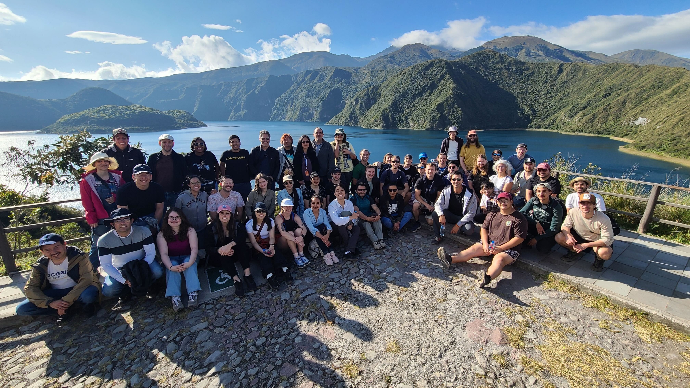
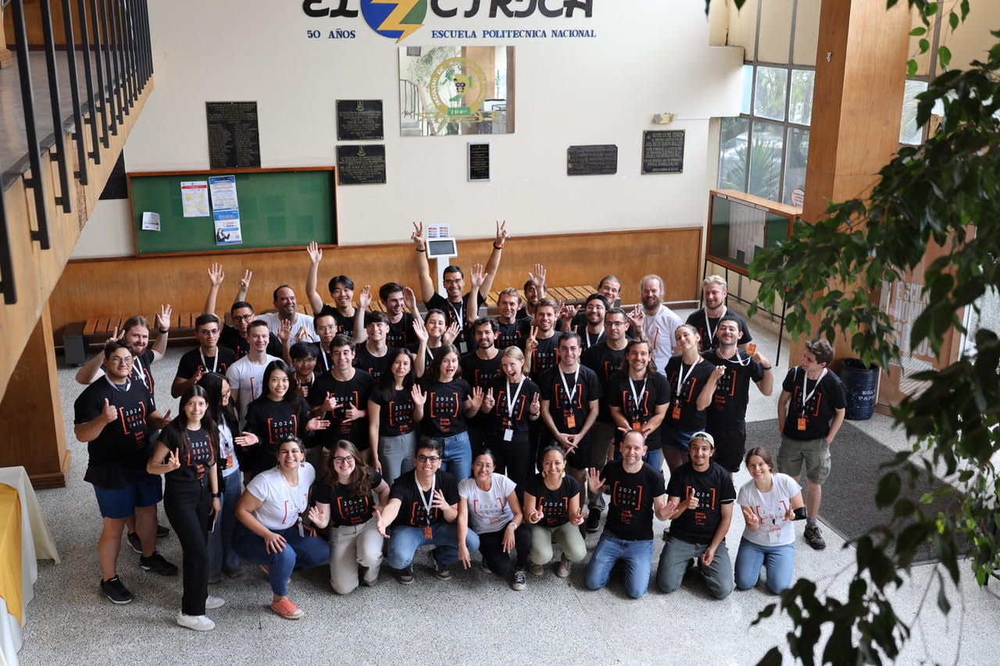

## 2024 Gene Golub SIAM Summer School

## Iterative and Randomized Methods for Large-Scale Inverse Problems

Our Summer School enabled students to learn state-of-the-art mathematical and statistical tools to discover information hidden within large-scale data sets and solve complex inverse problems. Through hands-on experience with techniques from Randomized Numerical Linear Algebra, data assimilation, iterative algorithms, and inverse problems we offered students a two-week summer school to learn this valuable range of computational mathematics topics. 

We welcomed students to the 2024 Gene Golub SIAM Summer School from 22 July to 2 August 2024. Here was our <a href="Advertisement.pdf">flyer</a>.

Location: Campus of the Escuela Politécnica Nacional, Ladrón de Guevara E11-253, Quito, Ecuador.  
Dates: 22 July - 2 Aug, 2024  
Organizers: <a href="http://www.math.emory.edu/~mchun45/">Matthias Chung</a>, <a href="https://twas.org/directory/de-los-reyes-juan-carlos">Juan Carlos de los Reyes</a>, <a href="https://www.cs.purdue.edu/homes/pdrineas/">Petros Drineas</a>, <a href="https://search.asu.edu/profile/85017">Rosemary Renaut</a>, <a href="https://pi.math.cornell.edu/~ajt/">Alex Townsend</a>.

## Group photo 

## Lecturers

- <a href="https://www.damtp.cam.ac.uk/user/cbs31/Home.html">Carola Bibane Schönlieb</a>
- <a href="http://www.math.emory.edu/~mchun45/">Matthias Chung</a>
- <a href="https://modemat.epn.edu.ec/~jcdelosreyes/">Juan Carlos de los Reyes</a>
- <a href="https://www.cs.purdue.edu/homes/pdrineas/">Petros Drineas</a>
- <a href="https://math.la.asu.edu/~mespanol/">Malena Inés Español</a>
- <a href="https://search.asu.edu/profile/85017">Rosemary Renaut</a>
- <a href="https://pi.math.cornell.edu/~ajt/">Alex Townsend</a>

## Some feedback 

  - "The school was very well organized, the best of the schools I attended ever. The students' presentations allowed us to know what our fellows are doing and to start scientific collaborations. I want to thank the local committee for all the effort. Love you guys!"
  - "The best summer school ever."
  - "The lectures and the location. The organizers were super nice. Saw a lot of the region while also learning a lot of new math. Everything was really well planned."
  - "Give Latin America more chances to organize events like this."
  - "It was an amazing experience. Thank you so much. Quito is a wonderful place. Maybe, in the future, it would be nice to promote more events like this summer school in Latin America."
  - "I really loved the fact that it was in South America. I think that I only became aware of the existence of the G2S3 because it was the first time in Latin America. If I may, I'll suggest that next editions could also happen in South America."
  - "It was really an amazing summer school. It was an opportunity for engagement as I have never experienced before. I am very grateful to have been here, and all the thanks to the organizers for the great job that they did!"
  - "The level of how the presentations were matched to each other. It was one experience rather than many separate talks. I also enjoyed the support from the local organizing team, who made our stay feel safe and entertaining."
  - "The lectures were outstanding and tailored to the audience; there was enough time to discuss with peers and professors."
  - "Just thank you. All the experience was amazing. In particular, for students that usually haven't got access to the kind of information exposed. And I need to say that I really appreciate the human part of the organization. The attention to the small details was admirable."
  - "Thank you so much for organizing all of this. This experience will be extremely influential in my personal and professional career in research."
  - "The instructors always took their time to answer questions in detail and participate in discussions. They carefully prepared their lectures and adapted them according to the requests and interests of the audience."
  - "I had an amazing time!"

<!--
## Important dates

<s>March 1, 2024: Application deadline for summer school</s>

<s>March 7, 2024: Extended application deadline for summer school</s>s>

<s>22 July - 2 August 2024: Summer school dates</s>

<s>31 July 2024: Banquet</s>

## Travel support

Acceptance to the summer school included full travel support. We provided an invitation letter for the accepted applicants who require a visa. All participants also got a certificate. 

## Summer school banquet

The summer school banquet took place at <a href="https://www.elventanal.ec/">El Ventanal</a> restaurant. Located in Quito's downtown.

## Locations

The Summer School was at Escuela Politécnica Nacional in Quito, Ecuador.

G2S3 classroom: Electric Engineering Building (Building 16)

## Accommodation

All the participants stayed at the <a href="https://www.fenixhotel.ec/">Fenix Hotel</a> in Quito.

## Getting to Quito, Ecuador

To travel to Quito, Ecuador, one would typically fly into Mariscal Sucre International Airport (IATA code: UIO). 
-->
## Contact

For information, contact <a href="mailto:matthias.chung@emory.edu">Matthias Chung</a>, <a href="mailto:juan.delosreyes@epn.edu.ec">Juan Carlos de los Reyes</a>, <a href="mailto:drineas@gmail.com">Petros Drineas</a>, <a href="mailto:renaut@asu.edu">Rosemary Renaut</a>, <a href="mailto:townsend@cornell.edu">Alex Townsend</a>.

## Sponsorship

The  summer school has been generously sponsored by: 
  
  
